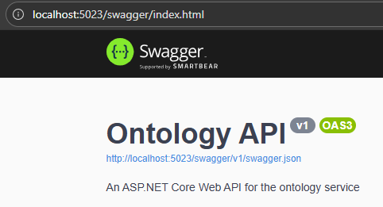
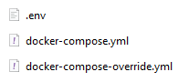

# Introduction

This document will guide you through the installation steps to start the Ontology Service in an organized manner.

# Prerequisites

- Ensure that the application `Docker Desktop` is running.
- Follow the installation instructions to locally set up:
  - `MiniO`
  - `Kafka`

# Technical Guide 

- There are two ways to set up this project. You only need to follow one of the setup options but you need access to the `Docker Image Hub` for both:
  - Click [here](#on-repository-access) on repository access when no docker compose files are provided.
  - Click [here](#on-image-access) when docker compose files are provided.

## On Repository Access

If you previously used the `start-all.bat` for project setup, you can ignore the following instructions.

- Clone your project into a local folder.
- Make sure your project is updated to the latest version.
- Navigate to `_docker/docker-compose-files/`
- Open your command line interface within your current working directory. On Windows, you can use either the `Terminal` or `PowerShell` by right-clicking while holding the `Shift` key and selecting the option that corresponds to your command line interface.
- Execute the following command: `docker compose -p ontology-service -f docker-compose.yml -f docker‐compose-override.yml up -d`.

If you can access `localhost:5023/swagger` your OntologyService Server is now ready for use. 

## On Image Access

If you previously used the `start-all.bat` for project setup, you can skip the following instructions.

To start the project, ensure you have three files in a single folder: `.env`, `docker-compose.yml`, and `docker-compose-override.yml`. The contents of these files are not essential for local setup.

- Open your command line interface within your current working directory. On Windows, you can use either the `Terminal` or `PowerShell` by right-clicking while holding the `Shift` key and selecting the option that corresponds to your command line interface.
- Execute the following command: `docker compose -p ontology-service -f docker-compose.yml -f docker‐compose-override.yml up -d`.

If you can access `localhost:5023/swagger` your OntologyService Server is now ready for use. 

